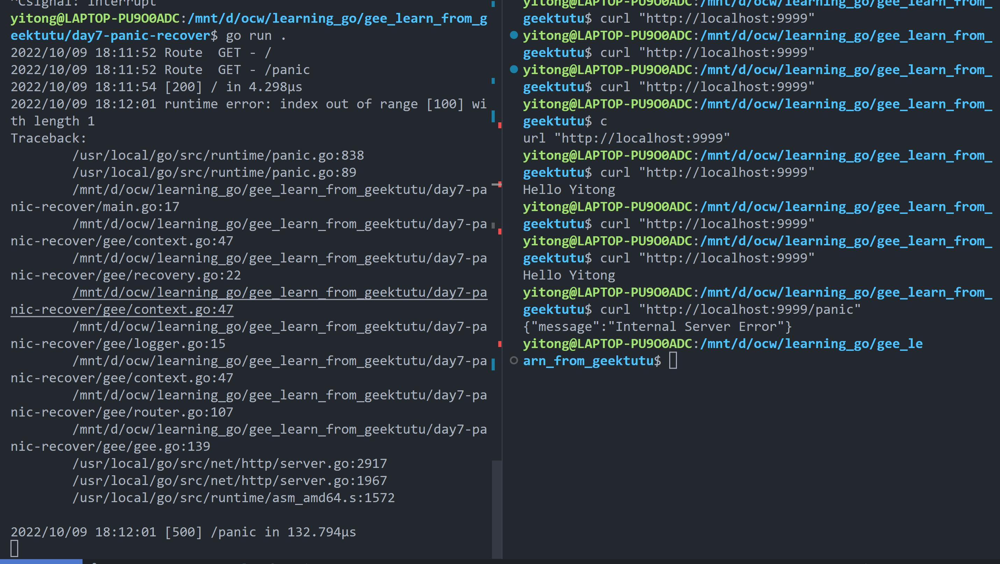

>该项目学习自[极客兔兔教程](https://geektutu.com/post/gee.html),意在实现一个Go语言实现的Web框架Gee

## 序言
### net/http
- 标准库net/http只是提供了基础的Web功能
    - 监听端口
    - 映射静态路由
    - 解析HTTP报文
- 但是并没有提供类似    
    - 动态路由：诸如hello/:name, hello/*这种规则
    - 鉴权：没有分组/统一鉴权的能力，需要在每个路由映射的handler中实现
    - 模板：没有统一简化HTML机制
## day1
- 实现了
    - 自定义路由映射表
    - 提供了用户注册静态路由的方法
    - 包装了启动服务的函数
## day2
- 实现了
    - 将路由(router)独立出来
    - 设计上下文(Context), 封装Request和Reponse，提供对JSON，HTML等返回类型的支持。设计Context的方法
        - 封装了*http.Request 和 http.ResponseWriter方法，简化了相关接口的调用
        - 解析动态路由/hello/:name
        - 存储中间件信息
## day3
- `动态路由`，指一条路由规则可以匹配某一类型而非某一条固定的路由，比如`/hello/:name`可以匹配`/hello/geektutu`，`/hello/jack`等
- 对于`路由`而言，需要实现注册路由规则，映射handler，访问时，匹配路由规则，查找对应的handler
- 实现动态路由(利用trie树)
    - 参数匹配`:`。比如`/p/:lang/doc`,可以匹配`/p/c/doc`和`/p/go/doc`
    - 通配`*`。比如`/static/*filepath`可以匹配`/static/fav.ico`和`/static/jQuery.js`,这个常用于静态服务器，能够`递归匹配子路径`
    - `*`和`:`的区别是`*`只能放在最后一个匹配项
## day4
- `分组控制`是指，路由的分组，也就是某一组路由需要相似的处理
    - 以`/post`开头的路由匿名可以访问
    - 以`/admin`开头的路由需要鉴权
    - 以`/api`开头的路由时`RESTful`接口，可以对接第三方平台，需要三方平台鉴权
- 大部分路由分组，都是以相同的前缀来区分的。还可以支持`子分组`，比如`/post`是一个分组，`/post/a`与`/post/b`是该分组下的子分组，作用在`/post`上的中间件，也会作用在子分组，子分组还可以应用自己特有的中间件
- 更新将`Engine`作为最顶层分组，也就是说`Engine`拥有`RouterGroup`所有能力，那么就可以将和罗友有关的函数，都交给`RouterGroup`实现了
## day5 
- 实现`Logger中间件`，能够记录请求到响应所花费的时间
- `中间件`是指，非业务技术类组件。Web框架本身不可能取理解所有的业务，因而不能实现所有功能，框架需要有一个插口，运行用户自己定义功能，嵌入到框架中，中间件需要考虑
    - `插入点`在哪里，使用框架的人不用关心底层逻辑的具体实现，如果插入点太底层，中间逻辑会过于复杂。如果插入点里用户太近，那和用户直接定义一套函数，每次在Hanlder中手动调用没区别
    - `中间件的输入`是什么，中间的输入决定了扩展能力，暴露的参数太少，用户发挥空间有限
- 框架设计，当接受到请求后，匹配路由，该请求的所有信息都保存在`Context`中，中间件也是。接受到请求后，应查找所有作用与该路由的中间件，保存在`Context`,一次进行调用，为什么依次调用后，还需要保存在`Context`中?因为在设计中，中间件不仅作用在处理流程前，也可以作用在处理流程后，即用户定义的`Handler`处理完毕后，还可以执行剩下的操作
- 对于执行中间件的`Next()`方法
## day6
- `服务端渲染`，现在流行前后端分离的开发模式，也即Web后端提供RESTful接口，返回结构化的数据(通常为JSON或者XML)。前端使用AJAX技术请求到所需的数据，利用JavaScript进行渲染。所以Vue/React等前端框架持续火热，这种开发模式前后端解耦。
    - 所以这样一来，后端专注解决资源利用，并发，数据库，只考虑数据如何生成，后端只关注数据，接口的返回值是结构化的，同一套后端服务可以同时支持小程序，移动APP，PC端Web页面，以及对外提供的接口
    - 前端专注于界面设计实现，只需要考虑拿到数据后如何渲染
- 实现了
    - `Web框架`支持服务端渲染。服务端渲染需要支持JS，CSS等静态文件。
    - gee框架需要做的就是解析请求地址，映射到服务器上文件的真实地址，交给`http.FileServer`处理就好
    - 为`Engine`结构体添加了`*template.Template`和`template.FuncMap`对象，前者将所有模板加载进内存，后者是所有的自定义模板渲染函数
    - 对于`(*Context).HTML()`做修改，使其可以根据模板文件名选择模板进行渲染
## day7
- `错误处理`，Go语言中错误处理一般是返回error，对于无法处理的错误，一般是直接panic
- `defer`会在panic之后，仍然执行defer中的语句，类似与`java`的`try...catch`
- `recover`函数可以避免整个程序因为`panic`而终止，recover函数只在defer中生效，recover会捕获panic
- 在Gee中增加`错误处理中间件Recovery`